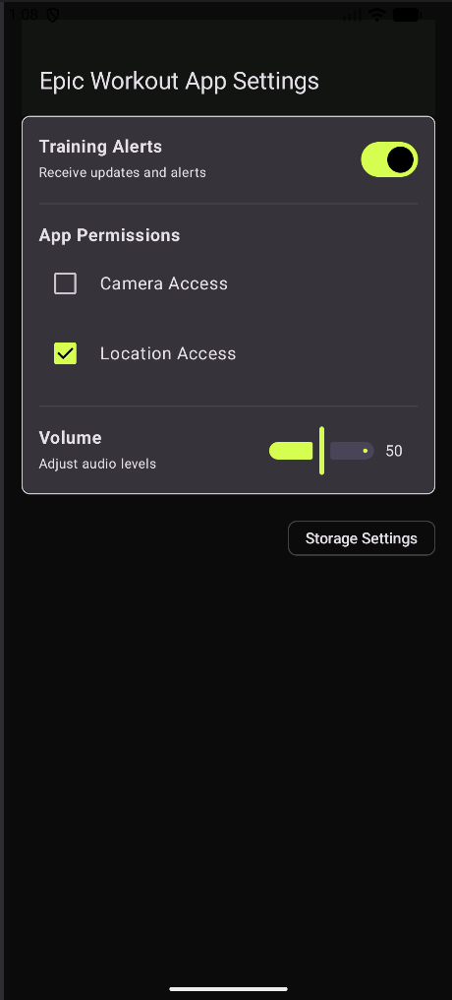

# Cafe Profile Screen (Box Layout Mastery)

### 📝 Project Overview
This project demonstrates the use of the `Box` layout to create a layered UI profile header. The design features a "Cafe" aesthetic, using a custom light color palette (Espresso and Cream) to create a warm, inviting user interface.

The core challenge of this screen was managing the 3-layer overlap between the background header, the user information card, and the circular profile avatar.

### 🚀 Key Technical Features
* **Layered Composition**: Utilizes a `Box` container to stack three distinct layers:
    1. **Background**: A solid color header section.
    2. **Middle**: An elevated M3 `Card` containing user stats and actions.
    3. **Foreground**: A circular `Surface` containing the user icon, positioned at the top using `zIndex`.
* **Overlap Logic**: Uses a combination of `Alignment.TopCenter` and `offset` modifiers to "pull" components into overlapping positions, creating a modern depth effect.

### 🎨 Material 3 Requirements Met
The following M3 components were used:
1.  **TopAppBar**: Standard screen header.
2.  **Card**: Used for the profile's main information container with custom elevation.
3.  **Badge**: Displays the "Active Now" status indicator.
4.  **FilledTonalButton**: Primary action for the rewards program.
5.  **AssistChip**: Secondary "Share" action.
6.  **Surface**: Used to create the circular, bordered container for the profile icon.
7.  **Icon**: Material Person icon used for the profile avatar.

### 🛠️ Modifiers Demonstrated
* `zIndex(1f)`: Ensures the profile avatar stays on the top-most layer regardless of code order.
* `offset(y = ...)`: Used to precisely position the Card and Avatar to create the overlap effect.
* `aspectRatio()`: Maintains a consistent shape for the profile card across different screen widths.
* `clip(CircleShape)` & `border()`: Used on the Surface to create the circular "cutout" look.
* `align()`: Used within the Box scope to center-align the profile elements horizontally.

---

### 📱 Execution Environment
* **Device**: Pixel 8 Pro Emulator
* **SDK Version**: Android 36 (targetSdk)
* **Min SDK**: 26
* **Compose BOM**: 2024.09.00

### 📸 Screenshot

# AI DISCLOSURE

### Universal AI Statment 
I utilized Gemini to ensure that I met each of the project requirements, as well as prompting it for assistance with commenting and ensuring my code followed standard Kotlin conventions. In several instances, AI-generated comments were omitted or manually rewritten to ensure accuracy and flow. Because the AI occasionally "hallucinated" requirements or skipped constraints, I manually verified every line of code against the rubric, using Gemini primarily as a second pair of eyes and a brainstorming partner.

Additionally, I used it to draft my READMES, though I occassionally needed to omit unneccessary (and frankly, sometimes strange) details.

---

### Q1: Settings Screen
* **Requirement Validation:** Gemini brought to my attention that I was missing the `weight` modifier requirement in my setting rows, which I implemented to improve the layout and meet the requirements specified.
* **Brainstorming:** Gemini assisted in brainstorming which types of settings (Alerts, Permissions, Volume) would logically map to specific Material 3 elements like `Switch`, `Checkbox`, and `Slider`.
